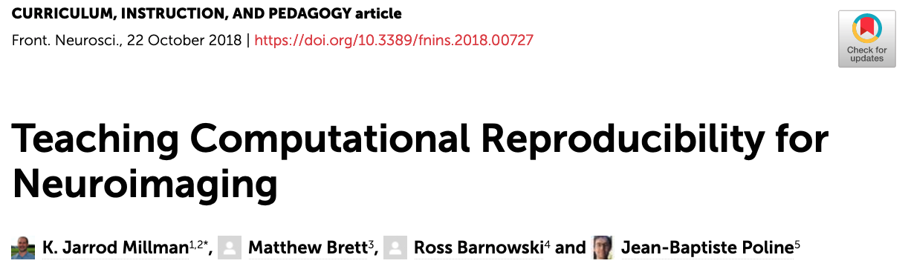

---
# YAML metadata
title: "What needs to change in the way we work and teach, to support reproducibility"
author: "Matthew Brett"
linkcolor: blue
urlcolor: blue
bibliography: [data-science-bib/data_science.bib, matthew_brett.bib]
<#ifndef HANDOUT>
suppress-bibliography: true
<#endif>
---

# Two views of reproducibility

* Compliance - reproducibility by retrofit
* Quality - reproducibility by design

# Reproducibility and data science

* Nearly all modern data analysis is "computational".
* Code is the foundation.
* Confusion, inefficiency and error are inevitable without organized practice.

# A personal history

* Medicine / neurology : 1990 — 96
* Functional brain imaging : 1996 —
* Open source scientific code : 1996 —
* Reproducibility : 2005 — 
* Reproducibility teaching : 2015 —

@Aston2006, @millman2018rcsds

# Computational reproducibility

> An article about computational science in a scientific publication is **not**
> the scholarship itself, it is merely **advertising** of the scholarship. The
> actual scholarship is the complete software development environment and the
> complete set of instructions which generated the figures —
> @buckheit1995wavelab (emphasis in original).

# Reproducibility as process

> In my own experience, error is ubiquitous in scientific computing, and one
> needs to work very diligently and energetically to eliminate it. One needs a
> very clear idea of what has been done in order to know where to look for
> likely sources of error. I often cannot really be sure what a student or
> colleague has done from his/her own presentation, and in fact often his/her
> description does not agree with my own understanding of what has been done,
> once I look carefully at the scripts. Actually, I find that researchers quite
> generally forget what they have done and misrepresent their computations — @donoho2010invitation

# Code in science

> In the early years of programming, a program was regarded as the private
> property of the programmer. One would no more think of reading a colleague's
> program unbidden than of picking up a love letter and reading it. This is
> essentially what a program was, a love letter from the programmer to the
> hardware, full of the intimate details known only to partners in an affair.
> Consequently, programs became larded with the pet names and verbal shorthand
> so popular with lovers who live in the blissful abstraction that assumes
> that theirs is the only existence in the universe. Such programs are
> unintelligible to those outside the partnership — Steve McConnell "Code
> Complete, second edition" (2004) p842.

# Genchi Genbutsu

* "Real location, real thing".
* "Go and see" / management by walking around.

<https://en.wikipedia.org/wiki/Genchi_Genbutsu>

# However

> A couple of months in the laboratory can frequently save a couple of hours
in the library. — attributed to [Frank
Westheimer](https://en.wikiquote.org/wiki/Frank_Westheimer).

# We should teach this

@millman2018rcsds

# A specific proposal

* Every graduate and undergraduate student should take an "introduction to data
  science" course, teaching data analysis with code.
* Every graduate and undergraduate student in the sciences should have a
  full course in process for organized collaboration and reproducibility.

# The end

Materials at <https://github.com/matthew-brett/uob-reproducibility>.

<#ifdef HANDOUT>
# References
<#endif>
